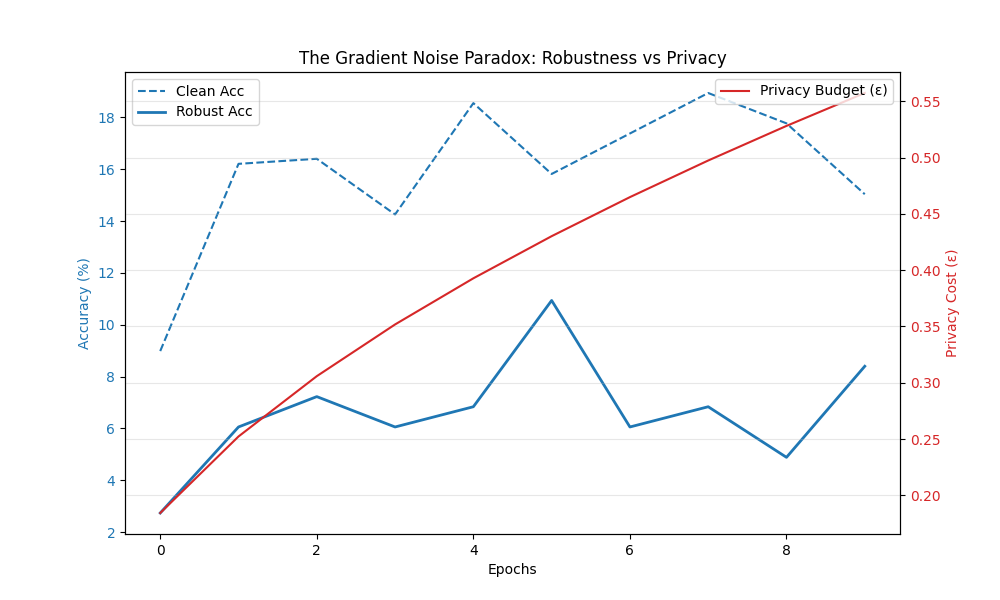

# The Gradient Noise Paradox: Robustness vs. Privacy
This repository explores a tension in machine learning safety: how Differential Privacy (DP) training (gradient clipping + noise injection) affects adversarial robustness. The codebase implements a Shadow Model technique so attacks can be generated without interfering with privacy accounting.

This README covers: result, installation, data preparation, example runs (train/evaluate), project structure, configuration points, and how to run tests.

## Quick summary
- Goal: empirically study whether DP-SGD (via Opacus) degrades adversarial robustness.
- Key idea: keep a non-private "shadow" model synchronized with the private model to craft adversarial examples using standard attack libraries.

## Requirements
This project targets Python 3.8+. The main dependencies are listed in `requirements.txt`.

## Result



Figure: Robustness vs Privacy tradeoff — this plot shows model adversarial accuracy (y-axis) against the privacy budget (epsilon, x-axis) or equivalently noise multiplier used during DP-SGD. Each curve/point compares either different noise multipliers or clipping norms (check the experiment legend in code/results). The general pattern in this repository's experiments is:

- As privacy becomes stronger (smaller epsilon / larger noise multiplier), adversarial accuracy falls — indicating worse robustness.
- For low-to-moderate noise, the drop can be gradual; at high noise the model often becomes both less accurate and less robust.
- Shadow-model attacks were used to avoid leaking private gradients while obtaining realistic adversarial examples.

Interpretation: DP-SGD's gradient clipping and added noise reduces the signal available to adversarial training or robustifying updates, which tends to degrade adversarial robustness. The plot summarizes those tradeoffs for the CIFAR-10 experiments in this repo.


## Installation
On Windows (PowerShell):

```powershell
python -m venv .venv
.\.venv\Scripts\Activate.ps1
python -m pip install --upgrade pip
pip install -r requirements.txt
```

On macOS / Linux:

```bash
python -m venv .venv
source .venv/bin/activate
python -m pip install --upgrade pip
pip install -r requirements.txt
```

If you don't have `requirements.txt` installed yet, install core packages manually (PyTorch, torchvision, opacus, torchattacks, numpy, matplotlib, pytest).

## Project layout

- `main.py` — top-level entry (example run).\
- `src/` — core code:
   - `config.py` — training and dataset configuration (change hyperparams here).
   - `models.py` — model definitions.
   - `train.py` — training loop, private model wrapper and shadow sync logic.
   - `utils.py` — helpers for data loading, metrics, plotting.
- `data/` — CIFAR-10 tar and extracted batches (already provided in this workspace).
- `results/` — saved plots and outputs (e.g., `tradeoff_plot.png`).
- `tests/` — unit tests (run with `pytest`).

## Data
This repository uses CIFAR-10. A copy of the dataset (python batches) is expected under `data/cifar-10-batches-py/`. If you have the `cifar-10-python.tar.gz` archive in `data/`, extract it with:

On Windows (PowerShell):

```powershell
tar -xzf data\cifar-10-python.tar.gz -C data
```

Or manually extract via your archive tool so that `data/cifar-10-batches-py/` exists and contains `data_batch_*`, `test_batch`, and `batches.meta`.

## Configuration
Open `src/config.py` to change hyperparameters such as learning rate, batch size, number of epochs, DP clipping/noise settings, and paths. Typical knobs:

- `DATA_DIR` — path to CIFAR-10 files (default: `data/cifar-10-batches-py`).
- `RESULTS_DIR` — where plots and saved artifacts go (default: `results`).
- DP-specific: `CLIP_NORM`, `NOISE_MULTIPLIER`, `MAX_GRAD_NORM`, `TARGET_EPS` (if present).

## Usage examples

Train a (non-private or private, depending on config) model:

```powershell
# from repo root
python main.py --config src/config.py
```

If `main.py` accepts CLI flags, pass those. Alternatively invoke `src/train.py` directly (example):

```powershell
python -m src.train --epochs 10 --batch-size 128
```

Evaluate and produce the robustness-vs-privacy plot

```powershell
python main.py --evaluate --plot tradeoff
```

Note: adapt flags according to the argument parser implemented in `main.py` or `src/train.py`.

## Development notes & assumptions
- The code uses a Shadow Model pattern: a private model is wrapped by Opacus for DP-SGD while a non-private shadow copy is used to generate adversarial examples (e.g., PGD) using standard attack libraries. The shadow model is synchronized at chosen intervals.
- If you need GPU acceleration, make sure PyTorch with CUDA is installed and available if you plan to train large experiments.

## Reproducibility and quick checks
1. Create virtual env and install deps.
2. Verify data is present: `data/cifar-10-batches-py/`.
3. Run a quick smoke train for 1 epoch to ensure code runs:

```powershell
python main.py --epochs 1 --batch-size 64
```

## License & contact
This repo is provided for research purposes. If you have questions, open an issue or contact the maintainer - Parikshith Saraswathi (https://parikshith-s.github.io/portfolio/)

---
